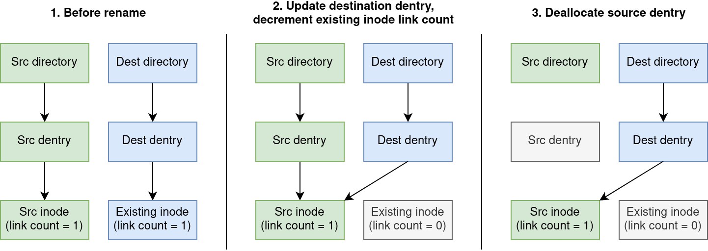

# Overview

This report discusses the implementation of several operations into VVSFS, the Very Very Simple File System. Our group completed all four baseline requirements (unlinking, renaming, inode stats, filesystem stats), the advanced task (indirect blocks), and two extensions (hard/soft links and block/character devices).

# Baseline

## Unlink Dentries and Removing Directories

TODO

## Renaming

We implement rename operations for files and directories via the `vvsfs_rename` method. Whenever a user runs the `mv` command in their shell, it issues a `renameat2()` syscall, which the VFS resolves to our `vvsfs_rename` method via the `.rename` entry in the `vvsfs_dir_inode_operations` struct.

There are two main cases for the rename operation: those where the destination dentry exists (because there is already a file/folder with the same name in the destination folder), and those where the destination does not exist.

In the simple case, where the destination dentry is not pre-existing, we can simply add a new dentry to the destination folder (setting the inode number to be that of the file to rename), and deallocate the old dentry from the source folder. Since these operations of finding, adding and removing dentries from folders are the same as those needed for the `vvsfs_unlink` function, we reuse many of the helper functions which were previously defined (`vvsfs_find_entry`, `vvsfs_delete_entry_bufloc`, etc). This eliminates code duplication and reduces the chance of bugs, as the dentry addition/removal logic is now tested via a wider variety of usage patterns.

Additional complications can emerge when the destination dentry already exists. There are many rules which govern whether a rename operation is allowed to overwrite an existing file or directory (e.g. depending on whether the destination directoy is empty). We consulted the man page for `rename()` and Michael Kerrisk's book *"The Linux Programming Interface"* to gain a deep understanding of these requirements, and carefully implemented checks to prevent invalid renames. The process of actually renaming the file is relatively similar to beforehand, with the one exception being that it is also necessary to decrement the link count in the existing file's inode. If the destination dentry was they only hard link to the existing file, it's link count will now be zero, which will cause the file to be deleted. This process is illustrated in Figure 1 below.

## Inode Attributes

We added support for storing `GID / UID / atime / ctime / mtime`. We acheived this by:

  1. Adding the fields to the `vvsfs_inode` structure.

  2. Loading the data within the `vvsfs_iget` method.
      - Following Minix / EXT2's lead we set the tv_nsec time to zero.

  3. Syncing the data to disk within the `vvsfs_write_inode` method.

  4. We chose to not implement `setattr / getattr` at this time since we didn't have anything meanful to change from the generic default function provided by the VFS.

Challenges implementing this feature:

  1. During initial development it was discovered that the filesystem was somehow relying on the order of the inital fields in the `vvsfs_inode`. Instead of properly resolving this issue we decided to store the new fields at the end of the struct.

  2. During testing it was discovered that the Linux kernel has measures to prevent disk trashing by not updating an inodes `atime` all the time. To override this and force the kernel to always update the times we added `strictatime` to our test mount script.

## Supporting FS Stats

TODO

# Advanced

## Indirect Blocks

TODO

# Extensions

## Hardlinks and Symbolic Links

TODO

## Special Devices

TODO

# Testing

 * We created our own test suite (vvsfs/vvsfs_tests)
    - We used a test driven development methodology, where we would create tests for expected behaviour and build new features to make them pass.
    - Additionally we utilised this as a regression test suite to ensure that new code didn't break existing functionality. Furthermore, whenever we fixed problems that were discoved, we built a test to ensure that we didn't break it again.
    - The suite is composed of a set of helper scripts that provide automatic generation of a test environment, and an [assertion framework](https://github.com/torokmark/assert.sh/blob/main/assert.sh) to provide nice error messages.

 * We used the [pjdfstest](https://github.com/pjd/pjdfstest) filesystem test suite to check our implentation for POSIX compliance and various other edge cases. By the end we passed all tests with the following exceptions:
    1. The tests for large files (2gb) files.
    2. The filesystem does not keep track of the `.` & `..` files in directories. As such, we failed the test that checks whether folder link counts are incremented correctly. We chose to ignore this due to [a note posted by Alwen on the course Ed forum](https://edstem.org/au/courses/12685/discussion/1633469).
    3. The filesystem does not correctly update ctime on truncate. (TODO: Does anyone want to fix this?)
    4. The filesystem does not store high presision time, only seconds like minix & ext2. (TODO: Does anyone want to fix this?)

 * TODO: Should we discuss the rename bug?