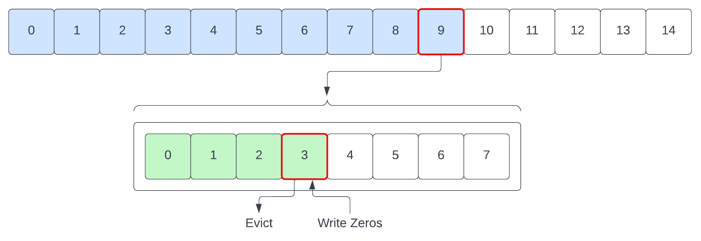
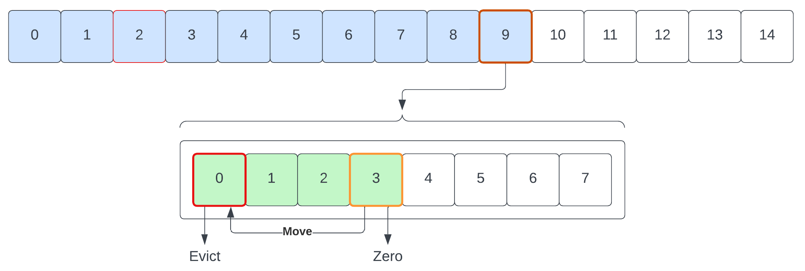
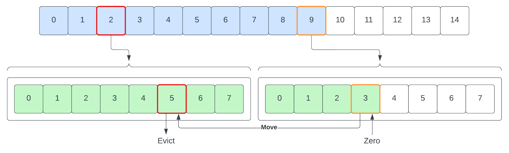
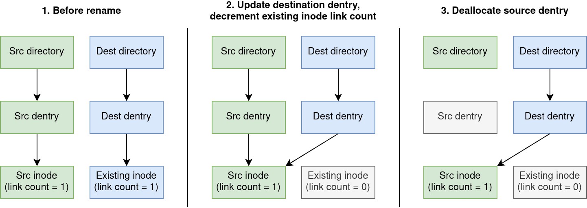
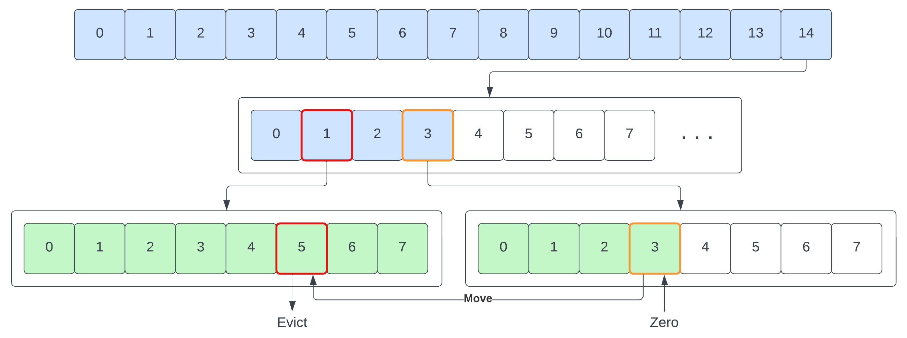
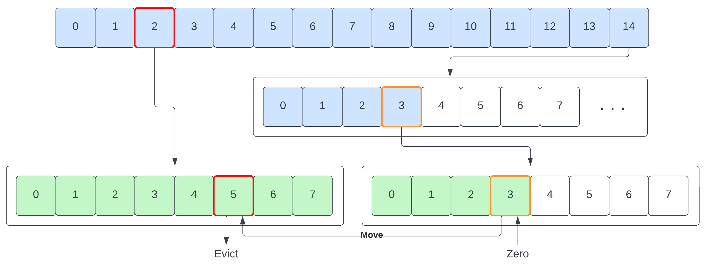
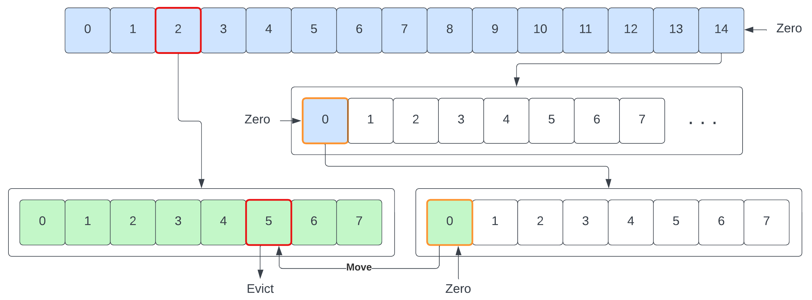

# Overview

This report discusses the implementation of several operations into VVSFS, the Very Very Simple File System. Our group completed all four baseline requirements (unlinking, renaming, inode stats, filesystem stats), the advanced task (indirect blocks), and two extensions (hard/soft links and block/character devices).

# Baseline

## Unlink Dentries and Removing Directories

### Unlink

Supporiting unlinking of dentries requires consideration around the behaviour of evicting entries from data blocks and potentially data blocks themselves.
In order to make this achievable, the unlink is split into two stages:
1. Find the dentry
2. Remove the dentry

Supporting find and remove operations is the `struct bufloc_t` implementation which stores block and dentry indices for ease of use. In addition to this, this
structure also has provisions to allow for the retention of the buffer object and dentry object (dependently) to aid in reducing the need for re-indexing into
buffers later (handled by flags `BL_PERSIST_BUFFER` and `BL_PERSIST_DENTRY`). These can also be resolved at a later time if necessary.

The method `vvsfs_find_dentry` is used to search through the data blocks and saturate a `bufloc_t` instance with the relevant information. This is then forwarded
to the `vvsfs_delete_entry` method to perform the actual removal. Search operations is merely a linear traversal of the blocks bound to the `inode`, attempting to
match the name and parent inode of a dentry to the target one.

Removing a dentry requires care to be taken around several cases for where the dentry is:

 1. Last dentry in the last block
 2. Non-last dentry in last block
 3. Any position dentry in non-last block

In the first case, we can simply evict the dentry (by zeroing it) and we are done. After that we consider if there are dentries left, if so we deallocate the block
and remove it from the `inode->i_data` array.



The second case requires moving the last dentry in the last block to fill the hole of the one being evicted. We do this with a memmove to overwrite the target dentry,
then zero the old location of the last dentry in the last block.



In the last case, we need to move the last dentry from the last block to our current block to fill the hole. This requires multiple buffer locations to be open at once,
ensuring we move and then zero the old location of the last dentry in the last block.



Once all shifting and operations have been performed with dentries and blocks, the inode matching the dentry is deallocated and returned to the available pool (bitmap).

### Directory Removal

In order to perform directory removal, we rely on the `vvsfs_unlink` operation implemented as detailed in the above section. But before performing an arbitrary unlink
on the dentry matching the directory there are checks needed. Specifically, we need to ensure that the dentry is a directory it is empty, this is done by traversing the dentries within the
directory and verifying that it is empty (only contains reserved entries). Reserved implies any of the following:

 1. Is either a `.` or `..` entry (not supported on disk, so not a problem but checked regardless), in the `..` case, we also verify that the parent inode matches the
    inode stored in the dentry.
 2. Reseved inode number, specifically `0` as the root.

If any of these checks fail, we return `-ENOTDIR` when not a directory and `-ENOTEMPTY` when it is not empty. Assuming these pass, we forward to the `vvsfs_unlink` call
targetting the dentry associated with the directory to be removed.

## Renaming

We implement rename operations for files and directories via the `vvsfs_rename` method. Whenever a user runs the `mv` command in their shell, it issues a `renameat2()` syscall, which the VFS resolves to our `vvsfs_rename` method via the `.rename` entry in the `vvsfs_dir_inode_operations` struct.

There are two main cases for the rename operation: those where the destination dentry exists (because there is already a file/folder with the same name in the destination folder), and those where the destination does not exist.

In the simple case, where the destination dentry is not pre-existing, we can simply add a new dentry to the destination folder (setting the inode number to be that of the file to rename), and deallocate the old dentry from the source folder. Since these operations of finding, adding and removing dentries from folders are the same as those needed for the `vvsfs_unlink` function, we reuse many of the helper functions which were previously defined (`vvsfs_find_entry`, `vvsfs_delete_entry_bufloc`, etc). This eliminates code duplication and reduces the chance of bugs, as the dentry addition/removal logic is now tested via a wider variety of usage patterns.

Additional complications can emerge when the destination dentry already exists. There are many rules which govern whether a rename operation is allowed to overwrite an existing file or directory (e.g. depending on whether the destination directoy is empty). We consulted the man page for `rename()` and Michael Kerrisk's book *"The Linux Programming Interface"* to gain a deep understanding of these requirements, and carefully implemented checks to prevent invalid renames. The process of actually renaming the file is relatively similar to beforehand, with the one exception being that it is also necessary to decrement the link count in the existing file's inode. If the destination dentry was they only hard link to the existing file, it's link count will now be zero, which will cause the file to be deleted. This process is illustrated in Figure 1 below.



## Inode Attributes

As part of the baseline tasks, we've added support for inode attributes. More specifically the following fields:

 * `GID`: group id
 * `UID`: user id
 * `atime`: access timestamp
 * `ctime`: change timestamp
 * `mtime`: modified timestamp

Structurally, the `vvsfs_inode` structure was the only place to update, adding the necessary fields. The current size denoted by the `VVSFS_INODESIZE` already makes
provision for all potential fields. Thus, no updates to the size of the structure used when writing to memory/disk are needed.

In order to load these fields, we updated the `vvsfs_iget` method to write the `atime/ctime/mtime` fields to the inode structure from the disk inode. Note that we also
set the nanoseconds to 0 (`tv_nsec` field on a time) to be consistent with `ext2` and `minixfs`. Additionally, the `vvsfs_write_inode` method was updated to perform the
inverse, writing the fields from inode to disk inode. Lastly, we did not implement `setattr/getattr` since there was nothing additional we desired above the generic
VSF implementation.

During the initial development of the inode attributes, position dependent behaviour was not accounted for in the struct packing for inodes. Given we are writing inodes
with the full size (not truncated to minimal packing size), we instead chose to pad the struct prior to writing to disk. Thus we write to the precise field position according
to the struct layout (assuming default packing). Another key point is that we discovered that the Linux kernel has provisions to prevent disk thrashing when updating the
`atime` field often. In order to override this behaviour and force the kernel to write through to disk, the `strictatime` parameter was included as a mounting option for
out testing scripts.

## Supporting FS Stats

The `struct kstatfs` layout details many fields that are normally somewhat flexible with creation and mounting options for file systens. However, VVSFS is very simple, as
the name implies and consequently almost all of the fields are static values that can be assigned directly. Specifically, all of the following fields are statically
defined in VVSFS:

 * `f_blocks = VVSFS_MAXBLOCKS`, we always configure the FS with the same block count, irrespective of creation configuration
 * `f_files = VVSFS_IMAP_SIZE * VVSFS_IMAP_INODES_PER_ENTRY`, since the bitmaps are 8 bit, using each bit for an inode, this is fixed based on imap size
 * `f_namelen = VVSFS_MAXNAME`, constant for any configuration of VVSFS
 * `f_type = VVSFS_MAGIC`, constant for any configuration of VVSFS
 * `f_bsize = VVSFS_BLOCKSIZE`, static value that is not configurable on mount or creation

The key fields are `f_bfree` (also `f_bavail = f_bfree` since we have no non-superuser scoped blocks) and `f_ffree` which are saturated by traversing the bitmaps to count
how many bits are set. This is done with bitmasking and counting while traversing with the map dimensions. It is also possible to do this more efficiently with
compiler (e.g. GCC `__popcountdi2`) or hardware intrinsics (e.g. x86 `popcnt`) for counting the bits in a fixed sized integer, in this case 8 bits. However,
these are not easy to manage within Kernel modules and don't add any significant speedups for an uncommon call.

# Advanced

## Indirect Blocks

There are three main areas that need to change to support indirect blocks, listing dentries, adding a new dentry and unlinking a dentry. In the first case of listing dentries,
this is the most straight forward. Instead of previously iterating over all the blocks in `i_data`, we traverse only the first 14 and load the dentries into memory,
then we check if a 15th exists (indicating indirect blocks are present), which is then buffered. Then we perform the same iteration over the block addresses within the
indirect block (via offset using `sizeof(uint32_t) * <iteration count>`). The iteration count (inclusive) is determined by subtracting 15 from the total block count.
We then traverse all dentries within each block, iterating 8 (dentries per block) times per block until the last entry where we use the total dentry cout modulo 8
as the limit. Note that due to the conventions of the code, there will never be a case where the indirect block is allocated with zero block entries within it.

When adding a new dentry, we first calculate the new block position and dentry offset using the following:

```c
uint32_t dentry_count = inode->i_size / VVSFS_DENTRYSIZE;
uint32_t new_dentry_block_pos = dentry_count / VVSFS_N_DENTRY_PER_BLOCK;
uint32_t new_dentry_block_off = dentry_count % VVSFS_N_DENTRY_PER_BLOCK;
```

If the `new_dentry_block_pos` is greater or equal to the current block count, we need to allocate a new block. This is done via `vvsfs_assign_data_block`, which
first determines if we are allocating a direct block, in which case it does and returns the new block address. If we are allocating an indirect block, we first
check if we have an indirect block allocated already, if we don't then it is created. Next we create a new block to store as the first indirect block and put
it's address in the indirect block. Lastly we return the first indirect block address.

If we don't need a new block, we call to `vvsfs_index_data_block` to get retrieve the data block address for the block associated wtih `new_dentry_block_pos`.
After this, we buffer the block, and write the dentry to the offset denoted by `new_dentry_block_off` which is guaranteed to be free, semantically guaranteed
by the logic flow that is.

From here on out, we initialise the dentry with the required data as necessary, name, inode number, etc.

Lastly, unlinking a dentry is a somewhat interesting set of changes. We need to extend the shifting behaviour to work with so-called spatially-disconnected
contiguous arrays. That is, the indirect and direct blocks are continugous notionally, as an array, whereby the indirect blocks require more calculation and
logic to index into. We need to support three main cases for dentry movement using indirect blocks:

 1. Direct only (using previous logic)
 2. Indirect only, dentry moves between indirect blocks
 3. Indirect to direct, dentry moves between indirect and direct blocks.

The first case is straightforward, as we can check the block count, if it is less than 15, we delegate to the old logic. In the second case, we check that the block
index (stored in `struct bufloc_t` passed as an argument from `vvsfs_find_entry`), is greater than or equal to 15, in which case we are only moving dentries within
indirect blocks. From here we apply the same logic as the first case, but operate over indirect blocks instead of direct blocks. In the third case, we need to apply
the same logic from the old direct-only implementation, but buffer both direct and indrect blocks at the same time.



In the case and thirs cases, a situation exists where the only dentry of the last (but not only) indirect block is moved, requiring deallocation of that indirect
block but not the indirect addresses block.



Again for the second and third cases, one last point of complexity is checking if we are moving the only dentry in the only indirect block to a direct block. In
this case we deallocate the first indirect block and the last direct block (indirect addresses block).



# Extensions

## Hardlinks

At this stage, our code was based on the asumption that any given file can only be referenced from a single place. That is, all inodes persist a link count of 1, to
themselves. The most notable methods affected by this assumption are `vvsfs_rename` and `vvsfs_unlink`. In these places, where links are decremented, we updated them
to use a common method that decrements the link acount and conditionally freeds the inode data blocks when that new link count is zero.

Having handled the case of links being decremented and them ensuring all resources are released when required, we turned to the case of adding a new hardlink. Specifically,
reusing the code for creating a new file, additional modifications were made to increment the link count of a given inode via `inode_inc_link_count` and then `ihold` to
inform the VSF that the link counts for an inode have changed.

## Symbolic Links

To grasp the initial concepts and implementation details involved with symlink support in a filesystem, we examined the `ext2` and `minixfs` implementations. The
most notable points was the use of `page_get_link` and `page_symlink` to drive their implementations. We followed suit in terms of implementation, regarding the
given `file` structure as the target. Though this brought a large complication, that `vvsfs_write_end` assumes `file` is always null. After extensive bug hunting
in the code we wrote, it was discovered that `page_symlink` alawys called `vvsfs_write_end` with a null file parameter as it utilised anonymous memory maps for the
file itself. In order to fix this, we changed the usage of `file->f_inode` to `mapping->host` to retrieve the inode pointer. This was reported to the 
[forum](https://edstem.org/au/courses/12685/discussion/1639912) which lead to it being fixed upstream in the project.

In terms of implementation, the core process is to create a new inode utilising the `S_IFLNK` to mark it as a symlink. Then invoking `page_symlink` to create an new
anonymous memory map and write the symbol name (the original file location) to it, completing the link. Lastly, a dentry is created in the parent directory of the
symlink location to act as the binding between the anomymous page in the inode and the parent directory through a dentry.

## Special Devices

Implementing special devices was very similar to the third basicline task of storing more attributes. This is because we simply needed to store a new attribute `i_rdev`, update the `iget` method to correctly instantiate a new inode, and update the `vvsfs_write_inode` to sync this new information to the disk. After this we creates the `vvsfs_mknod` basic of `vvsfs_create` and updated the `vvsfs_new_inode` helper method to be able to create a special node.

# Testing

We created our own test suite (found in vvsfs/vvsfs_tests), which can be run using the script `run_all_tests.sh`. The suite is composed of a set of helper scripts that provide automatic generation of a test environment, and an [assertion framework](https://github.com/torokmark/assert.sh/blob/main/assert.sh) to provide nice error messages. We used this suite as part of a test driven development methodology (where we would create tests for expected behaviour and build new features to make them pass), as well as for regression testing (whenever we discovered/fixed a bug, we would write a new test to prevent it from occuring again).

There is one bug found by our test suite which we were unable to fix before submission - the assertion on line 60 of `test_mv_overwrite.sh`. This test involves creating two files in the same directory, and then renaming one to the other, causing an overwrite. Our assertions to check that the move was successful initially pass, however after a remount, the destination file contents are wiped. This behaviour is non-deterministic, and usually does not occur until the test suite has been run 3-4 times on a fresh VM image. Our investigations have led us to believe that the provided template code allocates the same data block twice in some cases; however despite extensive attempts by all of our team members and our tutor (Felix) to try and diagnose the issue, we were unfortunately unable make any progress.

In addition to our own suite, we used the [pjdfstest](https://github.com/pjd/pjdfstest) filesystem test suite to check our implentation for POSIX compliance and various other edge cases. By the end we passed all tests with the following exceptions:
    1. Large file (2gb) tests.
    2. Folder link count checks. These failed because our filesystem does not keep track of the reserved `.` & `..` files in directories, which was an implementation decision we made based [a note posted by Alwen Ed](https://edstem.org/au/courses/12685/discussion/1633469).
    3. The filesystem does not correctly update `ctime`` on truncation.
    4. The filesystem does not store high presision time, only seconds like minix & ext2.

Finally, we ran our filesystem through [xfstests](https://github.com/kdave/xfstests) and [fs-fuzz](https://github.com/regehr/fs-fuzz) test suites. This uncovered a large number of concurrency issues which we believe are related to the provided assignment template code. We believe they may be related to the double block allocation issue mentioned above. If we had more time we would try to find the cause and solve these concurrency related problems.
